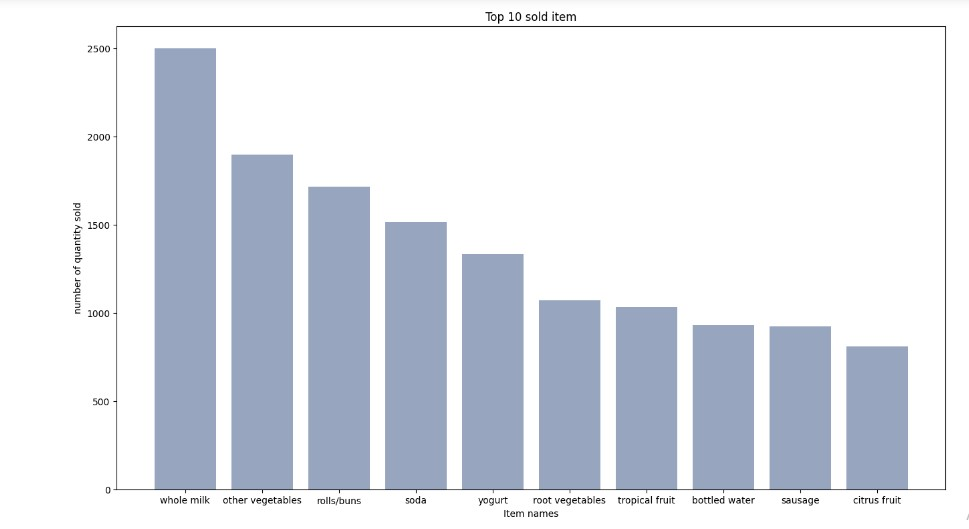
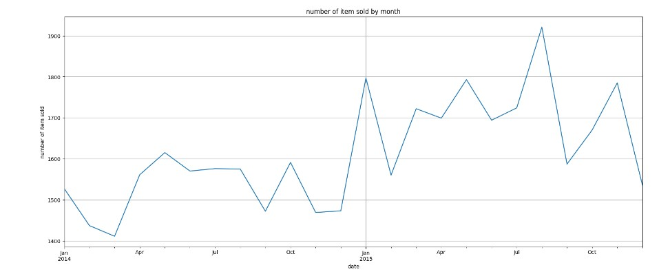
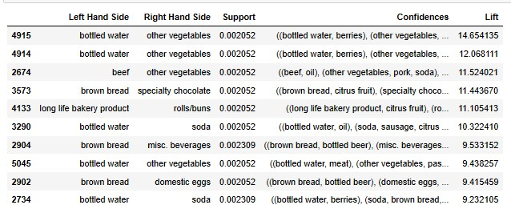

# Market-Basket-Analysis

## Introduction
Market Basket Analysis is a data mining technique that is used to identify relationship between products that are frequently purchased together by analyzing transaction data from retail stores or e-commerce websites.

This project extracts valuable insights from transaction data and understands customer purchasing behaviour for business optimization. 

## Data Preparation
- I checked the availability of null values and there was no null value.
- I converted the date to DateTime format.

## Exploratory Data Analysis(EDA)
- I selected the required variable for modelling and removed whitespace if there was any.
- I combined all the items in the list format for each customer.

## Market Basket Analysis
- I imported apriori from apyori for the model creation.
- I put the results in list format for a better view.
- I obtain results from the model in a readable format.

## Visualization

This bar chart shows the top 10 items sold with whole milk having the highest quantity sold and citrus fruit having the lowest.

This line chart shows that the highest number of items were sold in August 2015 and the lowest number of items were sold in March 2014.

This table shows the items that customers are likely to buy together.

## Recommendation
Put the items that customers are likely to buy together in the same place while displaying items to enhance customer decision.

